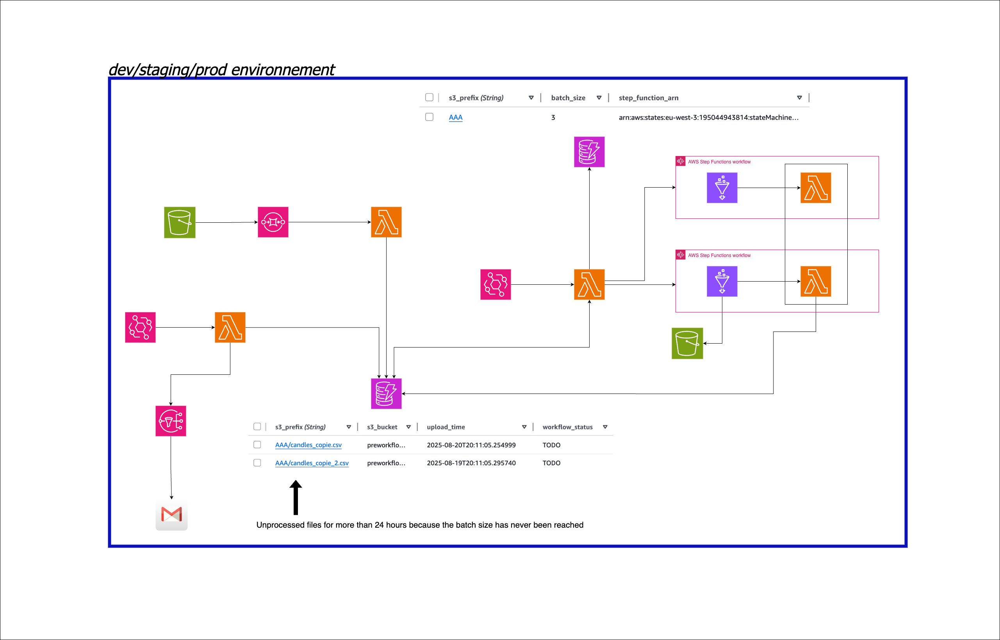
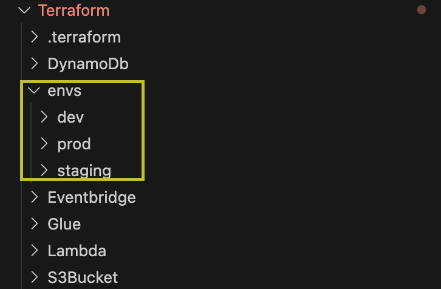

## Part 4 - Refactoring Terraform for Multi-Environment Deployment

#### NOTE : THIS README WAS WRITTEN MANUALLY WITHOUT THE USE OF ANY GEN AI TOOL. PLEASE TAKE THE TIME TO READ IT, AS I PUT EFFORT INTO WRITING IT RATHER THAN JUST TELLING CHATGPT TO DO IT FOR ME 🙂 .

How is the project evoluating : 

    - Version 1 : A first mvp pipeline that ingest single files.
    - Version 2 : Decoupled the pipeline into two phases to allow the workflow to batch process the files rather than just processing one file at a time.
    - Version 3 : Added an enhancement to the pipeline that allowed us to get daily monitor reports about the files that didn't get processed yet.
    - Version 4 : Refactoring the Terraform code for multi-environment deployment (dev, staging, production).

**Note :** Make sure to check out the [Version 1 repository](https://github.com/hamzabel99/Data_Ingestion_V1) and the [Version 2 repository](https://github.com/hamzabel99/Data_Ingestion_V2) and the [Version 3 repository](https://github.com/hamzabel99/Data_Ingestion_V3) first, as it’s essential to understand the foundation before diving into Version 4.

For the 4th version, I completely refactored the Terraform code to create three separate deployment environments — dev, staging, and prod — while following Terraform best practices to improve maintainability and usability.

**Ideas for the next versions :** More Monitoring and CloudWatch alarms, Deploy Lambdas function into Docker containers, Automate through GITHUB Action Lambda's images building and pushing to ECR, Athena Tables to query data, Add new workflow that don't necessary ingest data through Glue Jobs but uses some AI model to classify images for example.

